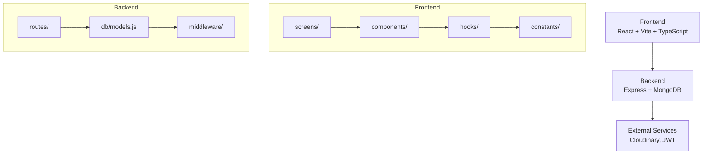
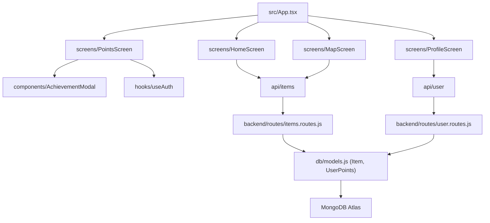

# TRASH2TREASURE


_**Trash2Treasure is a community recycling mobile app where users report abandoned items and others can collect them.**_

The app promotes recycling and reuse, allowing users to earn points, complete challenges, and unlock achievements while contributing to a cleaner environment.

&nbsp;&nbsp;&nbsp;&nbsp;


&nbsp;&nbsp;&nbsp;&nbsp;
[](https://github.com/ismaelmarot/trash2treasure/blob/HEAD/LICENSE)
&nbsp;&nbsp;&nbsp;&nbsp;

&nbsp;&nbsp;&nbsp;&nbsp;

### Frontend Stack


### Backend Stack


&nbsp;&nbsp;&nbsp;&nbsp;


<br>

<p  align="center">
  <a href="https://ismaelmarot.github.io/Trash2Treasure/" target="_blank">
    
  </a>
</p>

<br>

------------------------------------------------------------------------------------

## What It Does?

- **Report abandoned items**: Users take photos and report items they find on the street
- **Collect items**: Other users can mark items as "collected" to encourage recycling
- **Eco Points system**: Earn points by reporting and collecting items
- **Daily, weekly, monthly, and yearly challenges**: Complete missions to earn stars and trophies
- **Unlockable achievements**: Unlock achievements by reaching specific milestones
- **Community ranking: Compete with other users on the recycler leaderboard
- **Weekly Eco Score**: Rating from A+++ to G based on your weekly activity
- **Level system**: Progress from "Green Curious" to "Ascended Gaia"
- **Categories and families**: Classify items by type (electronics, organic, construction, etc.)

&nbsp;&nbsp;&nbsp;&nbsp;

------------------------------------------------------------------------------------

## 🛠️ INFRASTRUCTURE & SERVICES

| Service | Badge | Description |
|---------|-------|-------------|
| **Frontend Deployment** |  | Hosting del frontend React con CDN global y SSL automático |
| **Backend Deployment** |  | Hosting del backend Node.js/Express con auto-deploy |
| **Database** |  | Base de datos NoSQL en la nube (MongoDB Atlas) |
| **Image Storage** |  | Almacenamiento y transformación de imágenes |
| **Email Service** |  | Plantillas de email diseñadas con React y componentes |
| **Email Delivery** |  | Entrega de emails transaccionales |
| **Error Monitoring** |  | Monitoreo de errores y performance |
| **Analytics** |  | Analíticas de visitantes y rendimiento |
| **UX/UI Design** |  | Diseño de interfaces y prototipado |


&nbsp;&nbsp;&nbsp;&nbsp;

------------------------------------------------------------------------------------

## 📑 [TABLE OF CONTENT](#-table-of-content)

1. [Highlights](#highlights)
2. [Core Features](#core-features)
3. [Technologies Stack](#technologies-stack)
4. [Codebase Layer Map](#codebase-layer-map)
5. [Installation](#installation)
6. [Usage](#usage)
7. [Project Structure](#project-structure)
8. [API Endpoints](#api-endpoints)
9. [Database Models](#database-models)
10. [Screenshots](#screenshots)
11. [Live Demo](#live-demo)
12. [Versions](#versions)

&nbsp;&nbsp;&nbsp;&nbsp;

------------------------------------------------------------------------------------

<a id="highlights"></a>
## 🌟 [HIGHLIGHTS](#-table-of-content)

- Full-stack application with React frontend and Express backend
- MongoDB database with Mongoose ODM
- Responsive mobile-first design
- JWT authentication system
- Real-time point calculation and challenge tracking
- Modular architecture with reusable components
- Fully typed with TypeScript
- Styled-components for CSS-in-JS
- CI/CD deployment with Vercel (frontend) and Render (backend)

&nbsp;&nbsp;&nbsp;&nbsp;

------------------------------------------------------------------------------------

<a id="core-feature"></a>
## ✨ [CORE FEATURES](#-table-of-content)

| Feature             | Description                                                      |
| ------------------- | ---------------------------------------------------------------- |
| User authentication | Registration, login, and profile management with JWT             |
| Report items        | Take photos and report abandoned items with location             |
| Collect items       | Mark items as collected to earn extra points                     |
| Eco Points          | Points system for reporting and collecting actions               |
| Challenges          | Challenges with star and trophy rewards                          |
| Achievements        | Unlockable achievements based on specific metrics                |
| Eco Score           | Weekly rating from A+++ to G based on activity                   |
| Division levels     | Progressive recycling level system                               |
| Community ranking   | User ranking based on total points                               |
| Categories          | Classification by type: electronics, organic, construction, etc. |
| Families            | Grouping: ECO, TECH, HEAVY, PACKAGING, REUSE                     |


&nbsp;&nbsp;&nbsp;&nbsp;

------------------------------------------------------------------------------------

<a id="technologies-stack"></a>
## 🛠️ [TECHNOLOGIES STACK](#-table-of-content)

| Category            | Library / Tool     | Version |
|---------------------|--------------------|---------|
| Frontend UI         | React              | ^18.2.0 |
| Frontend Language   | TypeScript         | ~5.3.0  |
| Frontend Build      | Vite               | ^5.0.0  |
| Frontend Styling    | styled-components  | ^6.0.0  |
| Frontend Icons      | react-icons        | ^5.0.0  |
| Error Monitoring    | Sentry             | Latest  |
| Backend Framework   | Express            | ^4.18.0 |
| Backend Language    | Node.js            | ^22.0.0 |
| Database            | MongoDB + Mongoose | Latest  |
| Authentication      | JWT                | ^9.0.0  |
| Image Upload        | Cloudinary         | Latest  |
| Email Templates     | React Email        | Latest  |
| Email Delivery      | SendGrid           | Latest  |
| Deployment Frontend | Vercel             |    -    |
| Deployment Backend  | Render             |    -    |

&nbsp;&nbsp;&nbsp;&nbsp;

------------------------------------------------------------------------------------

<a id="corebase-layer-map"></a>
## 🔄 [CODEBASE LAYER MAP](#-table-of-content)



&nbsp;&nbsp;&nbsp;&nbsp;

------------------------------------------------------------------------------------

<a id="installation"></a>
## 🚀 [INSTALLATION](#-table-of-content)

### Prerequisites

- Node.js >= 18
- MongoDB (local or Atlas)
- npm or yarn

### 1. Clone the repository

```bash
git clone https://github.com/ismaelmarot/trash2treasure.git
cd trash2treasure
```

### 2. Install frontend dependencies

```bash
cd frontend
npm install
```

### 3. Install backend dependencies

```bash
cd backend
npm install
```

### 4. Setup environment variables

**Copy the example files and configure your secrets:**

```bash
# Backend
cp backend/.env.example backend/.env

# Frontend
cp frontend/.env.example frontend/.env
```

**Then edit each `.env` file with your own values:**

**Backend (/backend/.env)**
| Variable                  | Description                                                 |
|---------------------------|-------------------------------------------------------------|
| `PORT`                    | Server port (default: 3000)                                 |
| `MONGODB_URI`             | MongoDB connection string (local or Atlas)                  |
| `JWT_SECRET`              | Secret key for JWT tokens (generate a strong random string) |
| `CLOUDINARY_CLOUD_NAME`   | Cloudinary cloud name                                       |
| `CLOUDINARY_API_KEY`      | Cloudinary API key                                          |
| `CLOUDINARY_API_SECRET`   | Cloudinary API secret                                       |

**Frontend (/frontend/.env)**
| Variable       | Description     |
|----------------|-----------------|
| `VITE_API_URL` | Backend API URL |

> ⚠️ **Important:** Never commit your `.env` files to version control. They are already in `.gitignore`.

### 5. Run development servers

**Backend**
```bash
cd backend
npm run dev
```

**Frontend**
```bash
cd frontend
npm run dev
```

### 6. Access the app

- Frontend: http://localhost:5173
- Backend API: http://localhost:3000

&nbsp;&nbsp;&nbsp;&nbsp;

------------------------------------------------------------------------------------

<a id="usage"></a>
## ⚙️ [USAGE](#-table-of-content)

### User Flow

| Step | Description                                            |
| ---- | ------------------------------------------------------ |
| 1    | Register or log in                                     |
| 2    | Explore the map of reported items                      |
| 3    | Report an abandoned item with photo and location       |
| 4    | Collect items from other users to earn extra points    |
| 5    | Check your score on the Points screen                  |
| 6    | Complete daily, weekly, monthly, and yearly challenges |
| 7    | Unlock achievable achievements                         |
| 8    | Level up and improve your Eco Score                    |

&nbsp;&nbsp;&nbsp;&nbsp;

------------------------------------------------------------------------------------

<a id="project-structure"></a>
## 📂 [PROJECT STRUCTURE](#-table-of-content)

```
TRASH2TREASURE
├── frontend/                    # React + Vite frontend
│   ├── src/
│   │   ├── App.tsx            # Root component
│   │   ├── screens/          # Screen components
│   │   │   ├── HomeScreen/
│   │   │   ├── MapScreen/
│   │   │   ├── PointsScreen/
│   │   │   └── ProfileScreen/
│   │   ├── components/       # Reusable UI components
│   │   ├── hooks/            # Custom React hooks
│   │   ├── constants/        # App constants (colors, categories)
│   │   ├── types/            # TypeScript definitions
│   │   └── utils/            # Utility functions
│   └── public/
│
├── backend/                    # Express + MongoDB backend
│   ├── routes/                # API routes
│   │   ├── auth.routes.js
│   │   ├── items.routes.js
│   │   ├── points.routes.js
│   │   └── user.routes.js
│   ├── db/
│   │   ├── models.js         # Mongoose schemas
│   │   └── mongo.js          # MongoDB connection
│   ├── middleware/
│   │   └── auth.js
│   └── index.js              # Express app entry
│
├── public/
│   └── icons/
│       └── app-icon.png
│
├── README.md
├── LICENSE
└── package.json
```

&nbsp;&nbsp;&nbsp;&nbsp;

------------------------------------------------------------------------------------

<a id="key-module-relationships"></a>
## 📂 [KEY MODULE RELATIONSHIPS](#-table-of-content)



&nbsp;&nbsp;&nbsp;&nbsp;

------------------------------------------------------------------------------------

<a id="api-endpoints"></a>
## 🔌 [API ENDPOINTS](#-table-of-content)

### Authentication

| Method | Endpoint           | Description       |
| ------ | ------------------ | ----------------- |
| POST   | /api/auth/register | User registration |
| POST   | /api/auth/login    | User login        |
| GET    | /api/auth/me       | Current user      |

| Method | Endpoint               | Description              |
| ------ | ---------------------- | ------------------------ |
| GET    | /api/items             | List all items           |
| POST   | /api/items             | Create new item (report) |
| GET    | /api/items/:id         | Get item by ID           |
| PUT    | /api/items/:id/collect | Mark item as collected   |

| Method | Endpoint                | Description                  |
| ------ | ----------------------- | ---------------------------- |
| GET    | /api/points/my-points   | Get user points and progress |
| GET    | /api/points/ranking     | Get user ranking             |
| POST   | /api/points/add-report  | Add points for reporting     |
| POST   | /api/points/add-collect | Add points for collecting    |

| Method | Endpoint          | Description    |
| ------ | ----------------- | -------------- |
| GET    | /api/user/profile | User profile   |
| PUT    | /api/user/profile | Update profile |

&nbsp;&nbsp;&nbsp;&nbsp;

------------------------------------------------------------------------------------

<a id="database-models"></a>
## 💾 [DATABASE MODELS](#-table-of-content)

### User

```javascript
{
  name: String,
  email: String (unique),
  password_hash: String,
  profile_image: String (Cloudinary URL),
  country: String,
  state: String,
  city: String,
  created_at: Date
}
```

### Item

```javascript
{
  user_id: ObjectId (ref: User),
  title: String,
  description: String,
  category: String,
  photos: [String],
  latitude: Number,
  longitude: Number,
  status: String (available | collected),
  collected_by: ObjectId (ref: User),
  created_at: Date
}
```

### UserPoints

```javascript
{
  user_id: ObjectId (ref: User),
  total_points: Number,
  total_reports: Number,
  total_collected: Number,
  division: String,
  category_points: Map,
  family_reports: Object,
  current_streak: Number,
  max_streak: Number,
  daily_reports: Number,
  weekly_reports: Number,
  monthly_reports: Number
}
```

### Achievement

```javascript
{
  user_id: ObjectId,
  achievement_id: String,
  name: String,
  description: String,
  icon: String,
  unlocked_at: Date
}
```

### UserChallengeProgress

```javascript
{
  user_id: ObjectId,
  challenge_id: String,
  period_start: Date,
  period_type: String (daily | weekly | monthly | annual),
  current_progress: Number,
  stars: Number,
  trophies: Number,
  completed: Boolean
}
```

&nbsp;&nbsp;&nbsp;&nbsp;

------------------------------------------------------------------------------------

<a id="screenshots"></a>
## 📸 [Screenshots](#-table-of-content)

>### 📱 Mobile

<p align="center">
  
  
  
  
</p>

<details>
<summary><strong>See more...</strong></summary>
<br>
<p align="center">
  
  
  
  
</p>
<p align="center">
  
  
</p>
</details>

<br>

&nbsp;&nbsp;&nbsp;&nbsp;

------------------------------------------------------------------------------------

<a id="live-demo"></a>
## 🌍 [LIVE DEMO](#-table-of-content)

| Service | URL | Status |
|---------|-----|--------|
| 🌐 **Frontend (Vercel)** | [https://trash2treasure-app.vercel.app](https://trash2treasure-app.vercel.app) |  |
| ⚙️ **Backend (Render)** | [https://trash2treasure.onrender.com](https://trash2treasure.onrender.com) |  |

&nbsp;&nbsp;&nbsp;&nbsp;

------------------------------------------------------------------------------------

<a id="versions"></a>
## 📌 [VERSIONS](#-table-of-content)

| Version | Date       | Changes                                                                                                         |
|---------|------------|-----------------------------------------------------------------------------------------------------------------|
| 1.0.0   | 22/03/2026 | Initial release - Core app with reporting, collecting, points, challenges, achievements, ranking, and Eco Score |

&nbsp;&nbsp;&nbsp;&nbsp;

------------------------------------------------------------------------------------

## 🔒 [SECURITY](#-table-of-content)

This project is designed to be safe for public deployment:

- **Environment Variables**: All sensitive data (API keys, database URLs, JWT secrets) are stored in `.env` files which are gitignored
- **Template Files**: `.env.example` files are provided as templates for configuration
- **No Hardcoded Secrets**: The codebase contains no hardcoded credentials
- **Password Hashing**: User passwords are hashed using bcrypt
- **JWT Authentication**: Secure token-based authentication with expiration

### For Production Deployment

1. Generate strong random values for all secrets
2. Use a secure MongoDB Atlas cluster with IP whitelist
3. Enable Cloudinary security features (unsigned uploads disabled)
4. Set up proper CORS configuration
5. Use HTTPS for all communications

&nbsp;&nbsp;&nbsp;&nbsp;

------------------------------------------------------------------------------------

## 📄 [LICENSE](#-table-of-content)

This project is licensed under the MIT License - see the [LICENSE](/trash2treasure/blob/HEAD/LICENSE) file for details.

&nbsp;&nbsp;&nbsp;&nbsp;

------------------------------------------------------------------------------------

## 📬 [CONTACT](#-table-of-content)

Open to collaboration, feedback, and new opportunities.

[](https://github.com/ismaelmarot)
[](https://linkedin.com/in/ismael-marot)
[](https://ismaelmarot.github.io)
