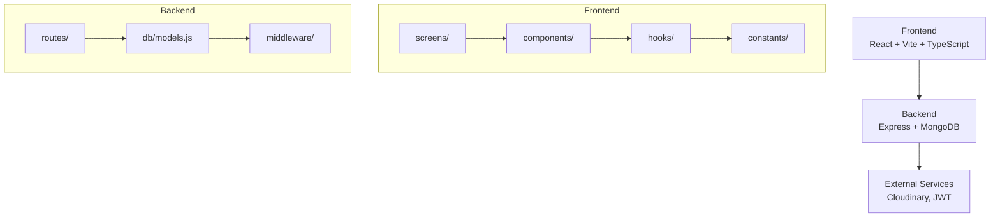
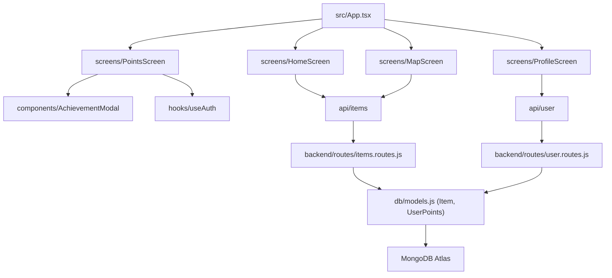

# TRASH2TREASURE


_**Trash2Treasure es una aplicación móvil de reciclaje comunitario donde los usuarios reportan objetos abandonados y otros usuarios pueden recolectarlos.**_

La app fomenta el reciclaje y la reutilización, permitiendo a los usuarios ganar puntos, completar desafíos y desbloquear logros mientras contribuyen a un entorno más limpio.


&nbsp;&nbsp;&nbsp;&nbsp;
[](https://github.com/ismaelmarot/trash2treasure/blob/HEAD/LICENSE)
&nbsp;&nbsp;&nbsp;&nbsp;

---

## 🔗 LIVE DEMO

| Service | URL | Status |
|---------|-----|--------|
| 🌐 **Frontend (Vercel)** | [https://trash2treasure-app.vercel.app](https://trash2treasure-app.vercel.app) |  |
| ⚙️ **Backend (Render)** | [https://trash2treasure.onrender.com](https://trash2treasure.onrender.com) |  |

---

## 🛠️ INFRASTRUCTURE & SERVICES

| Service | Badge | Description |
|---------|-------|-------------|
| **Frontend Deployment** |  | Hosting del frontend React con CDN global y SSL automático |
| **Backend Deployment** |  | Hosting del backend Node.js/Express con auto-deploy |
| **Database** |  | Base de datos NoSQL en la nube (MongoDB Atlas) |
| **Image Storage** |  | Almacenamiento y transformación de imágenes |
| **Email Service** |  | Servicio de envío de emails transaccionales |
| **Analytics** |  | Analíticas de visitantes y rendimiento |
| **UX/UI Design** |  | Diseño de interfaces y prototipado |

### Design Tools


---

## 📋 BADGES

### Project Info


### Frontend Stack


### Backend Stack


---

## What It Does?

- **Reportar objetos abandonados**: Usuarios fotografían y reportan objetos que encuentran en la calle
- **Recolectar objetos**: Otros usuarios pueden marcar objetos como "recolectados" para incentivar el reciclaje
- **Sistema de puntos Eco Points**: Gana puntos por reportar y recolectar objetos
- **Desafíos diarios, semanales, mensuales y anuales**: Completa misiones para ganar estrellas y trofeos
- **Logros desbloqueables**: Desbloquea logros por alcanzar metas específicas
- **Ranking comunitario**: Compite con otros usuarios en el ranking de recicladores
- **Eco Score semanal**: Calificación de A+++ a G basada en tu actividad semanal
- **Sistema de niveles**: Progresa desde "Curioso Verde" hasta "Gaia Ascendido"
- **Categorías y familias**: Clasificación de objetos por tipo (electrónicos, orgánicos, construcción, etc.)

---

## 📑 TABLE OF CONTENT

1. [Highlights](#highlights)
2. [Core Features](#core-features)
3. [Technologies Stack](#technologies-stack)
4. [Codebase Layer Map](#codebase-layer-map)
5. [Installation](#installation)
6. [Usage](#usage)
7. [Project Structure](#project-structure)
8. [API Endpoints](#api-endpoints)
9. [Database Models](#database-models)
10. [Screenshots](#screenshots)
11. [Live Demo](#live-demo)
12. [Versions](#versions)

---

## 🌟 HIGHLIGHTS

- Full-stack application with React frontend and Express backend
- MongoDB database with Mongoose ODM
- Responsive mobile-first design
- JWT authentication system
- Real-time point calculation and challenge tracking
- Modular architecture with reusable components
- Fully typed with TypeScript
- Styled-components for CSS-in-JS
- CI/CD deployment with Vercel (frontend) and Render (backend)

---

## ✨ CORE FEATURES

| Feature | Description |
|---------|-------------|
| User authentication | Registro, login y gestión de perfil con JWT |
| Report items | Fotografiar y reportar objetos abandonados con ubicación |
| Collect items | Marcar objetos como recolectados para ganar puntos extra |
| Eco Points | Sistema de puntos por acciones de reporte y recolección |
| Challenges | Desafíos con recompensas de estrellas y trofeos |
| Achievements | Logros desbloqueables por métricas específicas |
| Eco Score | Calificación semanal de A+++ a G según actividad |
| Division levels | Sistema de niveles progresivos de reciclaje |
| Community ranking | Ranking de usuarios por puntos totales |
| Categories | Clasificación por tipo: electrónicos, orgánicos, construcción, etc. |
| Families | Agrupación: ECO, TECH, HEAVY, PACKAGING, REUSE |

---

## 🛠️ TECHNOLOGIES STACK

| Category | Library / Tool | Version |
|----------|---------------|---------|
| Frontend UI | React | ^18.2.0 |
| Frontend Language | TypeScript | ~5.3.0 |
| Frontend Build | Vite | ^5.0.0 |
| Frontend Styling | styled-components | ^6.0.0 |
| Frontend Icons | react-icons | ^5.0.0 |
| Backend Framework | Express | ^4.18.0 |
| Backend Language | Node.js | ^22.0.0 |
| Database | MongoDB + Mongoose | Latest |
| Authentication | JWT | ^9.0.0 |
| Image Upload | Cloudinary | Latest |
| Deployment Frontend | Vercel | - |
| Deployment Backend | Render | - |

---

## 🔄 CODEBASE LAYER MAP



---

## 🚀 INSTALLATION

### Prerequisites

- Node.js >= 18
- MongoDB (local or Atlas)
- npm or yarn

### 1. Clone the repository

```bash
git clone https://github.com/ismaelmarot/trash2treasure.git
cd trash2treasure
```

### 2. Install frontend dependencies

```bash
cd frontend
npm install
```

### 3. Install backend dependencies

```bash
cd backend
npm install
```

### 4. Setup environment variables

**Copy the example files and configure your secrets:**

```bash
# Backend
cp backend/.env.example backend/.env

# Frontend
cp frontend/.env.example frontend/.env
```

**Then edit each `.env` file with your own values:**

**Backend (/backend/.env)**
| Variable | Description |
|----------|-------------|
| `PORT` | Server port (default: 3000) |
| `MONGODB_URI` | MongoDB connection string (local or Atlas) |
| `JWT_SECRET` | Secret key for JWT tokens (generate a strong random string) |
| `CLOUDINARY_CLOUD_NAME` | Cloudinary cloud name |
| `CLOUDINARY_API_KEY` | Cloudinary API key |
| `CLOUDINARY_API_SECRET` | Cloudinary API secret |

**Frontend (/frontend/.env)**
| Variable | Description |
|----------|-------------|
| `VITE_API_URL` | Backend API URL |

> ⚠️ **Important:** Never commit your `.env` files to version control. They are already in `.gitignore`.

### 5. Run development servers

**Backend**
```bash
cd backend
npm run dev
```

**Frontend**
```bash
cd frontend
npm run dev
```

### 6. Access the app

- Frontend: http://localhost:5173
- Backend API: http://localhost:3000

---

## ⚙️ USAGE

### User Flow

| Step | Description |
|------|-------------|
| 1 | Regístrate o inicia sesión |
| 2 | Explora el mapa de objetos reportados |
| 3 | Reporta un objeto abandonado con foto y ubicación |
| 4 | Recolecta objetos de otros usuarios para ganar puntos extra |
| 5 | Consulta tu puntuación en la pantalla de Puntos |
| 6 | Completa desafíos diarios, semanales, mensuales y anuales |
| 7 | Desbloquea logros alcanzables |
| 8 | Sube de nivel y mejora tu Eco Score |

---

## 📂 PROJECT STRUCTURE

```
TRASH2TREASURE
├── frontend/                    # React + Vite frontend
│   ├── src/
│   │   ├── App.tsx            # Root component
│   │   ├── screens/          # Screen components
│   │   │   ├── HomeScreen/
│   │   │   ├── MapScreen/
│   │   │   ├── PointsScreen/
│   │   │   └── ProfileScreen/
│   │   ├── components/       # Reusable UI components
│   │   ├── hooks/            # Custom React hooks
│   │   ├── constants/        # App constants (colors, categories)
│   │   ├── types/            # TypeScript definitions
│   │   └── utils/            # Utility functions
│   └── public/
│
├── backend/                    # Express + MongoDB backend
│   ├── routes/                # API routes
│   │   ├── auth.routes.js
│   │   ├── items.routes.js
│   │   ├── points.routes.js
│   │   └── user.routes.js
│   ├── db/
│   │   ├── models.js         # Mongoose schemas
│   │   └── mongo.js          # MongoDB connection
│   ├── middleware/
│   │   └── auth.js
│   └── index.js              # Express app entry
│
├── public/
│   └── icons/
│       └── app-icon.png
│
├── README.md
├── LICENSE
└── package.json
```

---

## 📂 KEY MODULE RELATIONSHIPS



---

## 🔌 API ENDPOINTS

### Authentication

| Method | Endpoint | Description |
|--------|----------|-------------|
| POST | /api/auth/register | Registro de usuario |
| POST | /api/auth/login | Inicio de sesión |
| GET | /api/auth/me | Usuario actual |

### Items

| Method | Endpoint | Description |
|--------|----------|-------------|
| GET | /api/items | Listar todos los items |
| POST | /api/items | Crear nuevo item (reportar) |
| GET | /api/items/:id | Obtener item por ID |
| PUT | /api/items/:id/collect | Marcar item como recolectado |

### Points

| Method | Endpoint | Description |
|--------|----------|-------------|
| GET | /api/points/my-points | Obtener puntos y progreso del usuario |
| GET | /api/points/ranking | Obtener ranking de usuarios |
| POST | /api/points/add-report | Agregar puntos por reporte |
| POST | /api/points/add-collect | Agregar puntos por recolección |

### User

| Method | Endpoint | Description |
|--------|----------|-------------|
| GET | /api/user/profile | Perfil del usuario |
| PUT | /api/user/profile | Actualizar perfil |

---

## 💾 DATABASE MODELS

### User

```javascript
{
  name: String,
  email: String (unique),
  password_hash: String,
  profile_image: String (Cloudinary URL),
  country: String,
  state: String,
  city: String,
  created_at: Date
}
```

### Item

```javascript
{
  user_id: ObjectId (ref: User),
  title: String,
  description: String,
  category: String,
  photos: [String],
  latitude: Number,
  longitude: Number,
  status: String (available | collected),
  collected_by: ObjectId (ref: User),
  created_at: Date
}
```

### UserPoints

```javascript
{
  user_id: ObjectId (ref: User),
  total_points: Number,
  total_reports: Number,
  total_collected: Number,
  division: String,
  category_points: Map,
  family_reports: Object,
  current_streak: Number,
  max_streak: Number,
  daily_reports: Number,
  weekly_reports: Number,
  monthly_reports: Number
}
```

### Achievement

```javascript
{
  user_id: ObjectId,
  achievement_id: String,
  name: String,
  description: String,
  icon: String,
  unlocked_at: Date
}
```

### UserChallengeProgress

```javascript
{
  user_id: ObjectId,
  challenge_id: String,
  period_start: Date,
  period_type: String (daily | weekly | monthly | annual),
  current_progress: Number,
  stars: Number,
  trophies: Number,
  completed: Boolean
}
```

---

## 📸 SCREENS

### Mobile Screenshots

*(Coming soon)*

---

## 🌍 LIVE DEMO

- **Frontend**: https://trash2treasure-app.vercel.app
- **Backend**: https://trash2treasure-api.onrender.com

---

## 📌 VERSIONS

| Version | Date | Changes |
|---------|------|---------|
| 1.0.0 | 22/03/2026 | Initial release - Core app with reporting, collecting, points, challenges, achievements, ranking, and Eco Score |

---

## 🔒 SECURITY

This project is designed to be safe for public deployment:

- **Environment Variables**: All sensitive data (API keys, database URLs, JWT secrets) are stored in `.env` files which are gitignored
- **Template Files**: `.env.example` files are provided as templates for configuration
- **No Hardcoded Secrets**: The codebase contains no hardcoded credentials
- **Password Hashing**: User passwords are hashed using bcrypt
- **JWT Authentication**: Secure token-based authentication with expiration

### For Production Deployment

1. Generate strong random values for all secrets
2. Use a secure MongoDB Atlas cluster with IP whitelist
3. Enable Cloudinary security features (unsigned uploads disabled)
4. Set up proper CORS configuration
5. Use HTTPS for all communications

---

## 📄 LICENSE

This project is licensed under the MIT License - see the [LICENSE](/trash2treasure/blob/main/LICENSE) file for details.

---

## 📬 CONTACT

Open to collaboration, feedback, and new opportunities.

[](https://github.com/ismaelmarot)
[](https://linkedin.com/in/ismael-marot)
[](https://ismaelmarot.github.io)
